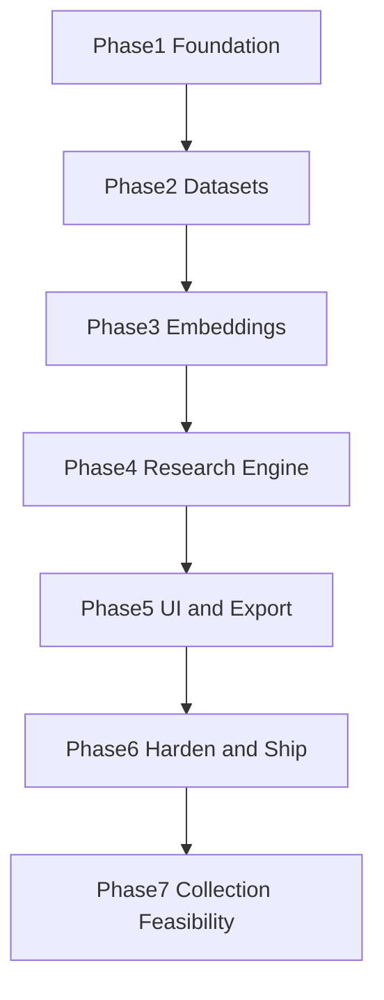

# Phase Architecture — Zepto AI Product Research Assistant

**Purpose:** Execution blueprint for building the MVP phase-by-phase so each phase ships a verified increment and Phase 6 leaves a stable, error-resistant product.

**Architecture lock:** Cloud free-tier — Next.js (Vercel) → FastAPI (Render) → Supabase PostgreSQL + pgvector → provider-agnostic AI APIs.

**Related docs:** [implementation-plan.md](./implementation-plan.md) (schema/API/layout), [engineering-spec.md](../engineering-spec.md) (how), [problem-statement.md](../problem-statement.md) (why/what).

**Rule:** Do not start Phase N+1 until Phase N exit criteria pass. Every phase includes its own error-handling and verification gates; Phase 6 does not invent quality from scratch — it audits and hardens what earlier phases already enforced.

---

## How to use this document

| Term | Meaning |
|------|---------|
| **Build** | Code and infrastructure to create |
| **Must handle** | Failure modes that must be coded in this phase (not deferred) |
| **Verify** | Manual or scripted checks before marking the phase done |
| **Exit criteria** | Hard gate — all must pass |
| **Out of scope** | Explicitly do not build in this phase |



---

## Cross-cutting standards (all phases)

Apply from Phase 1 onward. Later phases extend them; they never rewrite them.

1. **API envelope** — Every JSON response uses `{ success, message, data }` or `{ success, message, errors }`. Never leak stack traces to clients.
2. **Typed contracts** — Pydantic on backend; Zod + TypeScript types on frontend. Reject bad input at the boundary.
3. **Structured logs** — Log import, embed, research, API errors with `event` + `context` JSON (no secrets).
4. **Config via env** — Secrets and provider URLs only in env / Settings; never hardcoded.
5. **RAG invariant** — From Phase 4 on: LLM is never called without retrieved evidence (or the request fails cleanly).
6. **Idempotent deletes** — Cascade deletes must leave no orphan chunks/reports.
7. **CORS** — Only `FRONTEND_URL` origin allowed in production.
8. **Definition of “done” for a task** — Implements the feature, handles listed errors, has a verify step, and does not break prior phase exit criteria.

---

## Phase 1 — Project foundation

### Objective

Stand up a deployable monorepo skeleton: empty but real frontend, backend, database connectivity, health check, logging, and response conventions. Prove the three cloud pieces talk to each other.

### Architecture delivered

```text
Browser → Vercel (Next.js shell)
              ↓ HTTPS
         Render (FastAPI /health)
              ↓
         Supabase (connection only; full schema migrated)
```

### Build checklist

**Repo**

- [ ] Create `frontend/`, `backend/`, `database/`, `prompts/`, `scripts/`, `docker/`, `docs/`
- [ ] Root `README.md` with local run + env overview
- [ ] `.gitignore` (node_modules, `.env`, `__pycache__`, `.venv`, uploads)
- [ ] `frontend/.env.example` and `backend/.env.example`

**Backend**

- [ ] FastAPI app entry (`app/main.py`) with `/api/v1/health`
- [ ] Settings module (pydantic-settings): `DATABASE_URL`, `FRONTEND_URL`, `LOG_LEVEL`, AI placeholders
- [ ] Standard success/error response helpers
- [ ] CORS middleware from `FRONTEND_URL`
- [ ] Structured logging on startup/shutdown
- [ ] SQLAlchemy engine + session dependency
- [ ] Alembic initialized; first migration creates full schema from implementation plan (tables may stay empty)
- [ ] `database/schema.sql` reference copy of DDL + `CREATE EXTENSION vector`
- [ ] `requirements.txt` + `Dockerfile` suitable for Render
- [ ] Global exception handler → standard error envelope (no traceback in body)

**Frontend**

- [ ] Next.js 15 App Router + TypeScript strict + Tailwind
- [ ] shadcn/ui base setup
- [ ] App shell with sidebar placeholders: Dashboard, Datasets, Research, History, Settings
- [ ] API client that reads `NEXT_PUBLIC_API_BASE_URL` and types the envelope
- [ ] Dashboard page that calls `/health` and shows online/offline status
- [ ] Loading and error UI for health check failure (Render cold start)

**Database**

- [ ] Supabase project; enable `vector` extension
- [ ] Apply Alembic migration successfully against Supabase
- [ ] Confirm empty tables exist: datasets, conversations, conversation_chunks, research_questions, reports, settings, logs

**Deploy (skeleton)**

- [ ] Backend on Render free web service
- [ ] Frontend on Vercel pointing at Render URL
- [ ] Document required env vars in README

### Must handle (errors in this phase)

| Failure | Expected behavior |
|---------|-------------------|
| Missing `DATABASE_URL` | App fails fast at startup with clear log |
| DB unreachable | `/health` returns degraded or 503 with message; no crash loop without logs |
| Frontend API URL wrong | Dashboard shows “API unreachable” + retry |
| CORS misconfig | Documented; health from browser works after fix |
| Unhandled exception | JSON `{ success: false, ... }`, HTTP 500, stack only in server logs |

### Verify

1. `GET /api/v1/health` → `success: true` locally and on Render.
2. Vercel homepage loads; health status becomes green after cold start.
3. Alembic `current` matches head on Supabase.
4. Hitting an unknown route returns the standard error shape (not HTML stack).

### Exit criteria

- [ ] Monorepo structure matches implementation plan
- [ ] Frontend deployed and can call backend health
- [ ] Schema migrated on Supabase with pgvector enabled
- [ ] README documents clone → env → migrate → run → deploy

### Out of scope

Dataset UI, import, embeddings, research, real AI calls, export.

### Phase gate note

If health or migrations fail, stop. No Phase 2 work on a broken foundation.

---

## Phase 2 — Dataset management (import, clean, store)

### Objective

Users can create datasets, upload CSV/JSON conversation files, see cleaned conversations stored, delete datasets, and track processing status — without embeddings yet (status may stop at `processing` / `imported` until Phase 3 completes indexing; prefer `pending` → `processing` → leave ready for Phase 3, or use `imported` intermediate — pick one status machine and stick to it).

**Recommended status machine:**

```text
pending → processing → imported → indexing → ready
                ↘ failed
```

Phase 2 owns through `imported` (or `processing` complete with conversations saved). Phase 3 advances `imported` → `indexing` → `ready`.

### Architecture delivered

```text
UI Datasets → POST /datasets → DB
UI Import   → POST /import (multipart)
                 → validate → clean → dedupe → INSERT conversations
                 → update conversation_count + status
```

### Build checklist

**Backend**

- [ ] Models/repos for `datasets`, `conversations`, `logs`
- [ ] `GET/POST/DELETE /datasets`, `GET /datasets/{id}`
- [ ] `POST /import` multipart: `dataset_id` + file
- [ ] CSV parser (required column: `content`; optional: author, rating, posted_at, url, external_id, source)
- [ ] JSON array import with same fields
- [ ] Cleaning service: trim, collapse whitespace, strip simple HTML, drop empty content
- [ ] Dedupe: prefer `(dataset_id, external_id)`; else content hash within dataset
- [ ] Row cap (e.g. 5,000) with clear error if exceeded
- [ ] Sample CSV under `scripts/` or `docs/samples/`
- [ ] Log events: `dataset_create`, `import_start`, `import_complete`, `import_failed`

**Frontend**

- [ ] Datasets list: name, source, count, status, created_at
- [ ] Create dataset form (React Hook Form + Zod)
- [ ] Import dialog (file picker, dataset target)
- [ ] Delete with confirmation
- [ ] Dataset detail: metadata + first N conversations
- [ ] Empty states (“No datasets yet”)
- [ ] Inline API error display from `errors` / `message`

### Must handle

| Failure | Expected behavior |
|---------|-------------------|
| Missing `content` column | 400 + field error; dataset status not corrupted |
| Empty file / all rows empty | 400; message explains no valid rows |
| Invalid `dataset_id` | 404 |
| Duplicate external_ids | Skip or upsert; return counts: inserted / skipped |
| Oversized file / too many rows | 400 with limit message |
| Partial DB failure mid-import | Transaction rollback; status `failed` + `error_message`; log |
| Delete dataset | Cascade removes conversations; UI refreshes |

### Verify

1. Create dataset via UI → appears in list.
2. Import sample CSV → conversation_count matches non-empty rows (minus dupes).
3. Detail page shows cleaned text (no raw HTML junk).
4. Delete dataset → gone from list; DB has zero related conversations.
5. Bad CSV → user-visible error; dataset not marked ready/imported incorrectly.

### Exit criteria

- [ ] Full dataset CRUD works on deployed stack
- [ ] Import path is transactional and logged
- [ ] Sample CSV documented in README
- [ ] Prior Phase 1 health checks still pass

### Out of scope

Chunking, embeddings, research endpoints, report generation.

### Phase gate note

Research must not be enabled in UI until Phase 4; Datasets page should not promise “Ready for research” until status is `ready` (Phase 3).

---

## Phase 3 — Embeddings and semantic index

### Objective

Turn imported conversations into chunked vectors in pgvector. Datasets become `ready` only when all chunks are embedded. Provide a retrieval helper used later by research (can expose an internal/dev search endpoint for smoke tests).

### Architecture delivered

```text
conversations → chunker → embed(batch) → conversation_chunks.embedding
                                              ↓
                                    similarity search by dataset_id
```

### Build checklist

**Backend**

- [ ] `ai_provider` abstraction: `embed(texts) -> vectors` (OpenAI-compatible HTTP)
- [ ] Config: `AI_PROVIDER`, `AI_API_KEY`, `AI_BASE_URL`, `EMBEDDING_MODEL`, `EMBEDDING_DIMENSIONS`
- [ ] Chunking: ~500–800 chars, overlap ~50–100; single chunk if short
- [ ] After import (or explicit “Index” action): create chunks, batch embed, store vectors
- [ ] Status: `imported` → `indexing` → `ready` | `failed`
- [ ] Dimension check: reject/store error if vector length ≠ `EMBEDDING_DIMENSIONS`
- [ ] pgvector index (HNSW or IVFFlat, cosine)
- [ ] `retrieve_similar(dataset_id, query_embedding, top_k)` repository method
- [ ] Optional: `POST /datasets/{id}/reindex` for rebuild
- [ ] Dev/smoke: `POST /api/v1/search` (dataset_id + query text) returning chunks — can remain internal or documented as debug

**Frontend**

- [ ] Show indexing status on dataset list/detail
- [ ] Disable “Run research” until `ready` (wire later in Phase 5; for now show status badge)
- [ ] Surface embed/API key errors as actionable messages (“Check AI_API_KEY / embedding model”)

### Must handle

| Failure | Expected behavior |
|---------|-------------------|
| Missing AI API key | Status `failed`; clear `error_message`; no silent empty embeddings |
| Provider rate limit / 429 | Retry with backoff (limited); then fail dataset with message |
| Partial batch failure | Do not mark `ready`; leave `failed` or retryable `indexing` |
| Dimension mismatch | Fail fast; log; do not insert bad vectors |
| Empty dataset | Cannot index; message “No conversations to index” |
| Reindex | Delete old chunks for dataset, recreate; transactional where practical |

### Verify

1. Import sample data → index → `status=ready`, chunk count > 0.
2. Smoke search for a known phrase from the CSV returns that conversation near top.
3. Wrong API key → `failed` with readable error; no `ready`.
4. Delete dataset removes chunks (no orphans).

### Exit criteria

- [ ] At least one full import→index path works against real provider + Supabase
- [ ] Similarity retrieval returns relevant chunks in a scripted smoke test
- [ ] Embedding dimension documented in README
- [ ] Phase 2 import still works end-to-end including auto-index or explicit index step

### Out of scope

LLM report generation, prompt templates, research UI.

### Phase gate note

Do not build research prompts until retrieval quality is verified on sample data.

---

## Phase 4 — Research engine (RAG + reports)

### Objective

Execute **free-form research questions** (optional preset shortcuts): retrieve evidence → build context → call LLM → persist structured report with citations and confidence. Enforce evidence-first invariant. Always store the user's `question_text` on the report.

### Architecture delivered

```text
POST /research { dataset_id, question, research_question_id?, top_k? }
  → validate question_text (required, length bounds)
  → optionally resolve preset → specialized prompt file
  → load prompts/free_form_research.md (default) or preset prompt
  → embed user question
  → pgvector top_k (dataset filter)
  → if no chunks: fail report (no LLM)
  → context + citations
  → LLM structured output
  → parse → reports row (completed) with question_text stored
```

### Build checklist

**Content**

- [ ] Primary prompt: `prompts/free_form_research.md` (required)
- [ ] Optional preset prompt files (pain_points, feature_requests, sentiment, discovery_behaviour, opportunities, executive_summary)
- [ ] Each prompt: evidence-only, quote customers, separate observation vs opportunity, require confidence, refuse if insufficient evidence
- [ ] Seed optional `research_questions` presets via SQL or startup seed

**Backend**

- [ ] `GET /research-questions` (optional presets)
- [ ] `POST /research` `{ dataset_id, question: string, research_question_id?, top_k? }` — `question` required
- [ ] Validate question: non-empty after trim; min ~10 / max ~2000 chars
- [ ] Report lifecycle: `pending` → `running` → `completed` | `failed`
- [ ] Always persist `question_text`; `research_question_id` nullable
- [ ] Context builder: numbered evidence blocks with conversation_id, source, url, snippet
- [ ] `chat()` on AI provider abstraction
- [ ] Response parser into: executive_summary, key_findings, root_causes, themes, opportunities, evidence[], confidence, confidence_rationale
- [ ] Confidence heuristic: e.g. high ≥8 diverse chunks, medium 4–7, low <4 (also allow model rationale; store both)
- [ ] `GET/DELETE /reports`, `GET /reports/{id}`
- [ ] Persist `model_provider`, `model_name` on report
- [ ] Refuse LLM call when retrieval empty
- [ ] Timeout handling for long LLM calls (user-facing failure, not hung worker forever)

**Settings (API)**

- [ ] `GET/PUT /settings` for provider, model, embedding model, top_k (DB overrides env defaults)

### Must handle

| Failure | Expected behavior |
|---------|-------------------|
| Dataset not `ready` | 400: index first |
| Empty / too-short / too-long `question` | 422 validation; no report created |
| Unknown preset id (if provided) | 404 |
| Inactive preset | 400/404 not runnable as shortcut |
| Missing `free_form_research.md` | Report `failed`; clear message |
| Zero retrieval hits | Report `failed`; message “Insufficient evidence”; **no LLM call** |
| LLM returns malformed JSON | Retry once with repair prompt or fail with parse error; never store invented evidence |
| LLM fabricates quotes | Prompt + post-check: evidence quotes must map to retrieved chunk ids; drop or flag unknowns |
| Provider outage | Report `failed` + message; log |
| Concurrent runs (MVP) | Allow sequential; if timeout, fail cleanly |

### Verify

1. `POST /research` with a custom free-form question on ready dataset → `completed` report with `question_text` + non-empty evidence citing real conversation IDs.
2. Empty/unrelated tiny dataset → `failed` without billing a successful hallucination path.
3. `GET /reports/{id}` returns all structured sections including the question asked.
4. Optional preset chip pre-fills question; research still stores resulting `question_text`.
5. Settings change model → next report stores new `model_name`.
6. Delete report works; dataset remains.

### Exit criteria

- [ ] RAG path enforced in code (empty retrieval short-circuits)
- [ ] Free-form questions runnable; optional presets work as shortcuts
- [ ] Reports stored with `question_text`, citations + confidence
- [ ] Smoke script covers free-form happy path + empty-evidence path + empty-question validation

### Out of scope

Polished research UI, PDF/DOCX export, dashboard polish (stubs OK).

### Phase gate note

Phase 5 only consumes stable report JSON. Freeze report schema before heavy UI work.

---

## Phase 5 — Frontend research UX + export

### Objective

Complete the five-page product experience: Dashboard, Datasets (already started), Research, History, Settings — plus Markdown export (PDF/DOCX best-effort). User can finish the full workflow without touching APIs manually.

### Architecture delivered

```text
Dashboard → stats + recent reports
Datasets  → create/import/status (from P2–P3)
Research  → select dataset + free-form question (+ optional presets) → run → show result
History   → list (question_text) + detail + export
Settings  → provider/model/embedding/top_k
```

### Build checklist

**Pages**

- [ ] **Dashboard:** total datasets, conversations, ready count, recent reports (show question snippet), CTAs
- [ ] **Research:** dataset select (only `ready`), **free-form question textarea (required)**, optional preset chips that pre-fill textarea, Run Analysis, loading state, result panel (or redirect to History detail)
- [ ] **History list:** question_text, dataset, confidence, date, status
- [ ] **History detail:** question asked + all report sections + evidence list (quote, source, link if url)
- [ ] **Settings:** form with Zod validation; save via PUT; show effective config
- [ ] TanStack Query for server state; consistent error toasts/banners

**Export**

- [ ] `GET /reports/{id}/export?format=md` (required)
- [ ] PDF and DOCX best-effort; if lib fails, return 501 or hide button — do not crash
- [ ] UI download buttons on History detail

**UX quality**

- [ ] Loading skeletons for list/detail
- [ ] Empty states for no datasets / no reports
- [ ] Disable Run when dataset not ready or question empty/invalid
- [ ] Cold-start friendly: retry messaging on first API call
- [ ] No dead nav links

### Must handle

| Failure | Expected behavior |
|---------|-------------------|
| Research request fails | Show API message; leave History with `failed` report if created |
| Empty question submit | Client Zod blocks Run; server 422 if bypassed |
| Export while report `failed` | Disable or 400 |
| Settings invalid model string | Client Zod + server validation |
| Stale list after create | Invalidate TanStack queries |
| Long-running research | Clear “Running analysis…” state; timeout message if API times out |

### Verify

1. Click-path: create → import → wait ready → type free-form question → research → view history → export Markdown file opens with citations.
2. Optional: click a preset chip → textarea pre-fills → run still works.
3. Settings change visible on next research report metadata.
4. Mobile-usable sidebar/nav (basic responsive).
5. All five nav items functional; no console errors on happy path.

### Exit criteria

- [ ] Full UI workflow works against deployed backend
- [ ] Markdown export verified
- [ ] Failed research visible and understandable in UI
- [ ] Phase 1–4 API contracts unchanged (UI is consumer only)

### Out of scope

Auth, live scrapers, multi-turn chatbot UI, analytics charts.

---

## Phase 6 — Harden, test, and production ship

### Objective

Eliminate residual defects, prove the MVP Definition of Done, document operations, and freeze a known-good deploy. This phase assumes Phases 1–5 already handled their local errors; Phase 6 is system-level verification and polish.

### Architecture delivered

```text
Smoke scripts + checklist + hardened edge cases + production README
= shippable free-tier MVP
```

### Build checklist

**Reliability**

- [ ] Audit every endpoint for envelope consistency
- [ ] Audit cascade deletes (dataset → conversations → chunks; reports)
- [ ] Cap and document import limits, top_k max, max upload size
- [ ] Ensure LLM path never runs without retrieval (code assertion/test)
- [ ] Idempotent reindex behavior documented
- [ ] Render cold start: frontend retry/backoff verified
- [ ] Rate-limit / provider errors show actionable copy

**Testing**

- [ ] `scripts/smoke_test_api.sh` (or `.py`): health → create → import → index → research with free-form question → get report → export md → delete
- [ ] Negative tests: bad CSV, empty retrieval, empty question, missing dataset, invalid settings
- [ ] Manual UI checklist executed once on production URLs

**Docs**

- [ ] README: architecture diagram, env table, sample CSV, deploy steps (Vercel/Render/Supabase), troubleshooting (CORS, cold start, pgvector, embedding dims)
- [ ] Note free-tier limits (Render sleep, Supabase size, AI quotas)
- [ ] Update `docs/implementation-plan.md` status only if needed (optional); keep this file as phase truth

**Performance (lightweight)**

- [ ] Dashboard and dataset list feel &lt; ~2s when backend warm
- [ ] Batch embeds reasonably (avoid one-request-per-chunk)

**Security (MVP-appropriate)**

- [ ] No secrets in repo or client bundle (only `NEXT_PUBLIC_API_BASE_URL`)
- [ ] Input validation on all mutating routes
- [ ] HTTPS only in production URLs

### Must handle (final sweep)

| Area | Pass condition |
|------|----------------|
| Data integrity | No orphan chunks; counts match DB |
| RAG safety | Automated or scripted proof of no-LLM-on-empty |
| UX | Every error path shows a human message |
| Deploy | Fresh clone + documented env can reach DoD |
| Regression | Phase 1–5 exit criteria still pass |

### End-to-end acceptance (Definition of Done)

- [ ] App reachable on Vercel
- [ ] Backend on Render connected to Supabase
- [ ] Create / import / delete datasets
- [ ] Conversations cleaned, stored, embedded
- [ ] Free-form research questions runnable (presets optional)
- [ ] Reports include question_text, summary, findings, evidence quotes + sources, confidence
- [ ] History + Markdown export
- [ ] AI provider/model switchable via Settings/env
- [ ] No auth required; file import sufficient (no live scrapers)
- [ ] README complete; smoke script green against staging/production

### Exit criteria

- [ ] All DoD boxes checked
- [ ] Smoke script green
- [ ] No known critical/high bugs open
- [ ] Product usable by a PM without engineer help for the core workflow

### Out of scope (post-MVP)

Auth, multi-tenant, queues, Supabase Storage migration, live connectors, Ollama default, agentic flows.

**Post-MVP collection (planned):** See [phase-7-collection-feasibility.md](./phase-7-collection-feasibility.md) — research/ToS feasibility first, then approved collectors into a master corpus. Do not start 7b connectors until 7a exit criteria pass.

---

## Phase dependency matrix

| Phase | Depends on | Blocks |
|-------|------------|--------|
| 1 Foundation | — | Everything |
| 2 Datasets | 1 | 3, 5 (datasets UI) |
| 3 Embeddings | 2 | 4 |
| 4 Research engine | 3 | 5 (research/history) |
| 5 UI + export | 2, 4 | 6 |
| 6 Harden | 1–5 | Release / Phase 7 |
| 7 Collection feasibility | 6 | Live connectors (7b+) |

---

## Error-free end state — quality model

“Error-free” for this MVP means **controlled failure**, not infinite scope:

1. **Happy path** works repeatedly on cloud free-tier.
2. **Every known failure mode** in phases above returns a clear API/UI message and leaves data consistent.
3. **RAG cannot hallucinate without evidence** because empty retrieval never calls the LLM.
4. **No silent corruption** — failed imports/indexes set `failed` + `error_message`.
5. **Smoke script** proves the spine after each deploy.
6. **Docs** allow a clean environment rebuild.

Phase 6 certifies this model; Phases 1–5 each contribute their slice.

---

## Suggested execution cadence

| Phase | Focus | Rough order of work |
|-------|--------|---------------------|
| 1 | Skeleton + deploy | Backend → DB → Frontend shell → deploy |
| 2 | Data in | API → cleaning → UI datasets |
| 3 | Vectors | Provider embed → chunk → index → smoke search |
| 4 | Insight | Free-form prompt → RAG → reports API → optional presets → settings |
| 5 | Product | Research/History/Dashboard/Settings/Export |
| 6 | Ship | Smoke + docs + edge-case audit |

---

## Next step

Begin **Phase 1** exactly as specified in this file’s Build checklist. Do not skip verification gates.
